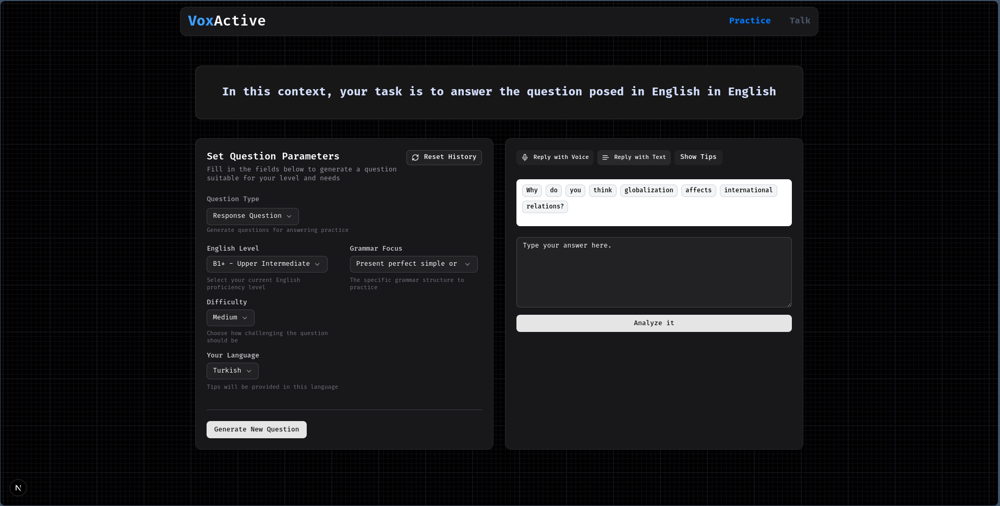

# App Images
## Learn to translate text in your own language using clues and word translations to translate it into English
### *You can respond by voice or text*


## Learn how to answer a question in English


## Learn by talking or writing about the topic you have set


# Getting Started

Follow the steps below to set up your development environment.

## 1. Install Dependencies

```bash
npm install
```
## 2. Configure Environment Variables
Create a **.env** file in the root directory and add the following keys:
```bash 
OPENAI_API_KEY=your OpenRouter API key
DEEPGRAM_KEY=your Deepgram API key
ELEVENLABS_KEY=your ElevenLabs API key (optional)

```

### 3. Start the Development Server
```bash 
npm run dev
```


# Languages

| L                   | L                   | L                    | L                     |
|--------------------------|----------------------------|---------------------------|-----------------------------|
| Amharic                  | Arabic                     | Azerbaijani               | Bengali                     |
| Bhojpuri                 | Czech                      | Dutch                     | French                      |
| German                   | Greek                      | Gujarati                  | Hausa                       |
| Hebrew                   | Hindi                      | Hungarian                 | Indonesian                  |
| Italian                  | Japanese                   | Javanese                  | Kannada                     |
| Korean                   | Malay                      | Malayalam                 | Mandarin Chinese            |
| Marathi                  | Myanmar (Burmese)          | Nepali                    | Odia (Oriya)                |
| Persian                  | Polish                     | Portuguese                | Punjabi                     |
| Romanian                 | Russian                    | Sinhala                   | Spanish                     |
| Swahili                  | Swedish                    | Tagalog (Filipino)        | Tamil                       |
| Telugu                   | Thai                       | Turkish                   | Ukrainian                   |
| Urdu                     | Vietnamese                 | Wu Chinese (Shanghainese) | Yoruba                      |
